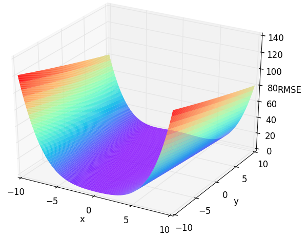
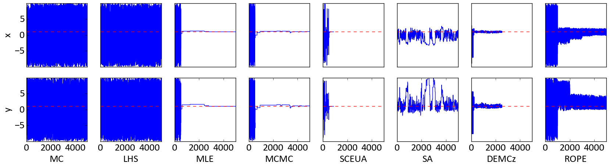

# The Rosenbrock

Before we start to calibrate a real model, we start with some numerical optimization problems. They are all about finding the optima, just like a model. 
We start here with a simple two dimensional (parameter) function: The Rosenbrock (aka. Banana), which your might already know from the [Getting started chapter](../getting_started.md). 
The Rosenbrock function is defined as:

$$f_{Rosen}(x,y) = (100(y - x^2)^2 + (1-x)^2$$ 
 
where we defined control variables as  *-10 < x < 10* and *-10 < y < 10*, with *f(x=1,y=1) = 0* 

*Figure 1: Response surface of the two dimensional Rosenbrock function. Check out `/examples/3dplot.py`to produce such plots.*

We want to find the global minimum of this function. To do so, one could test every possible parameter setting for *x* and *y* OR one can use SPOTPYPY.

## Creating the setup file

First we have to build a setup Python file, containg all above mentioned informations about the Rosenbrock. 
We start to have a look at the parameters *x* and *y*:

	import spotpy
	import numpy as np
	
	class spotpy_setup(object):
		def __init__(self):
			self.params = [spotpy.parameter.Uniform('x',-10,10,1.5,3.0,-10,10),
						   spotpy.parameter.Uniform('y',-10,10,1.5,3.0,-10,10),
						   ]
		def parameters(self):
			return spotpy.parameter.generate(self.params)

We assume to have no prior knowledge about the parameters *x* and *y*, which is why we select a uniform prior distribution from them using NumPy.
Numpy offers a wide range of distributions such as uniform, normal and chi-squared. 
As a minimum (`low`) of the distribution we select *-10* and as maximum (`high`) *10*. The next information which is needed is the name of each parameter (`x` and `y`).
The `stepsize` is biggest possible jump, which a algorithm can make to the next sampling point (used in MCMC, MLE and SA). 
It is used as the standard derivation within a normal distribution around the last sampled point.
The `optguess` value is the initial parameter setting. It will be your first sample in the results and should be selected to a good as possible setting, 
because it influences how the algorithms evolove from this position.
Further settings can be made by minbound and maxbound, which set the boundaries for the algorithms to sample parameter combination inside the prior given range. If they are not given,
bound are determined by sampling 1,000 times from the prior distribution and selecting the minimum and maximum of the sampled values as bounds.

The next function should call our actual model, given a parameter combination from the above created function:
			
		def simulation(self,vector):      
			x=np.array(vector)
			simulations= [sum(100.0*(x[1:] - x[:-1]**2.0)**2.0 + (1 - x[:-1])**2.0)]
			return simulations

Now we have to create a function, which is containing the response of our function, when it is called with the optimal values.
In this case, we know, that *f(x=1,y=1) = 0*. Accordingly, our evaluation function returns *0*:
			
		def evaluation(self):
			observations=[0]
			return observations

Finally, we have to create a function to evaluate our samples. To do so, we select a objective function out of the SPOTPYPY objective function package. 
In this case we select the Root Mean Squared Error, giving the simulations and the evaluations. 
As we want to minimize our function, we select a negative objective function at this point.

		def objectivefunction(self,simulation,evaluation):
			objectivefunction= -spotpy.objectivefunctions.rmse(evaluation,simulation)      
			return objectivefunction

For other works keep in mind:

* Simulation function must not return values besides for which evaluation values are available.  			

* MCMC and DEMCz do not use the objective function and have their own likelihood function (logarithmic probability density). Both algorithms are very sensitive to the given likelihood function and would require a complex adaptation to other likelihood functions.
			
Now you just have to save this file, e.g. `spotpy_setup_rosenbrock.py`.
			
## Sampling

Now that we crated our setup file, we want to start to investigate our function.
One way is to analyse the results of the sampling is to have a look at the objective function trace of the sampled parameters. 

We start directly with all algorithms. First we have to create a new file:

	import spotpy
	from spotpy.examples.spotpy_setup_rosenbrock import spotpy_setup   # Load your just created file from above 
	
Now we create samplers for every algorithm and sample 5,000 parameter combinations for every algorithm:

	results=[]
	spotpy_setup=spotpy_setup()
	rep=5000

	sampler=spotpy.algorithms.mc(spotpy_setup,    dbname='RosenMC',    dbformat='csv')
	results.append(sampler.sample(rep))

	sampler=spotpy.algorithms.lhs(spotpy_setup,   dbname='RosenLHS',   dbformat='csv')
	results.append(sampler.sample(rep))

	sampler=spotpy.algorithms.mle(spotpy_setup,   dbname='RosenMLE',   dbformat='csv')
	results.append(sampler.sample(rep))

	sampler=spotpy.algorithms.mcmc(spotpy_setup,  dbname='RosenMCMC',  dbformat='csv')
	results.append(sampler.sample(rep))

	sampler=spotpy.algorithms.sceua(spotpy_setup, dbname='RosenSCEUA', dbformat='csv')
	results.append(sampler.sample(rep,ngs=4))

	sampler=spotpy.algorithms.sa(spotpy_setup,    dbname='RosenSA',    dbformat='csv')
	results.append(sampler.sample(rep))

	sampler=spotpy.algorithms.demcz(spotpy_setup, dbname='RosenDEMCz', dbformat='csv')
	results.append(sampler.sample(rep,nChains=4))

	sampler=spotpy.algorithms.rope(spotpy_setup,  dbname='RosenROPE',  dbformat='csv')
	results.append(sampler.sample(rep))
	
	sampler=spotpy.algorithms.abc(spotpy_setup, dbname='RosenDEMCz', dbformat='csv')
	results.append(sampler.sample(rep))

	sampler=spotpy.algorithms.fscabd(spotpy_setup,  dbname='RosenROPE',  dbformat='csv')
	results.append(sampler.sample(rep))

## Plotting

To see the all results of your sampling, just type something like this:

	algorithms=['MC','LHS','MLE','MCMC','SCEUA','SA','DEMCz','ROPE','ABC','FSCABC']
	spotpy.analyser.plot_parametertrace_algorithms(results,algorithmnames=algorithms,parameternames=['x','y']) 

This should give you an nice overview about, how the parameter settings evolve during the sampling of each algorithm: 

*Figure 2: Parameter traces as blue line of the two dimensional Rosenbrock function. The red dotted line is the optimal value for each parameter.*

One can see here that every algorthm was able to find quasie optimal parameter settings during the sampling.
Especially `MLE` and `MCMC` yield very good results after the burn-in phase.
Parameter `y` has a higher uncertainty than parameter `x`, which is obvious when you have a look back at *Figure 1*.

## Sensitivity Analysis

One might be interested which parameter has now more importance. Therefore SPOTPY comes along with the 
Fourier Amplitude Sensitivity Test (FAST). It will return you a FAST sensitivity index ranging from 0 to 1 for every parameter.
The higher the value, the higher the sensitivity of the parameter.

To use this sampler we just have to type

	sampler=spotpy.algorithms.fast(spot_setup,  dbname='RosenFAST',  dbformat='csv')
	sampler.sample(rep)

Which should give you something like this
	
`> Parameter First Total`

`> x 0.883849 0.961862`

`> y 0.020266 0.035932`

This is indicating a much higher total sensitivity of parameter `x=0.96` then of parameter `y=0.04` in the investigated parameter bounds (see Figure 1).
