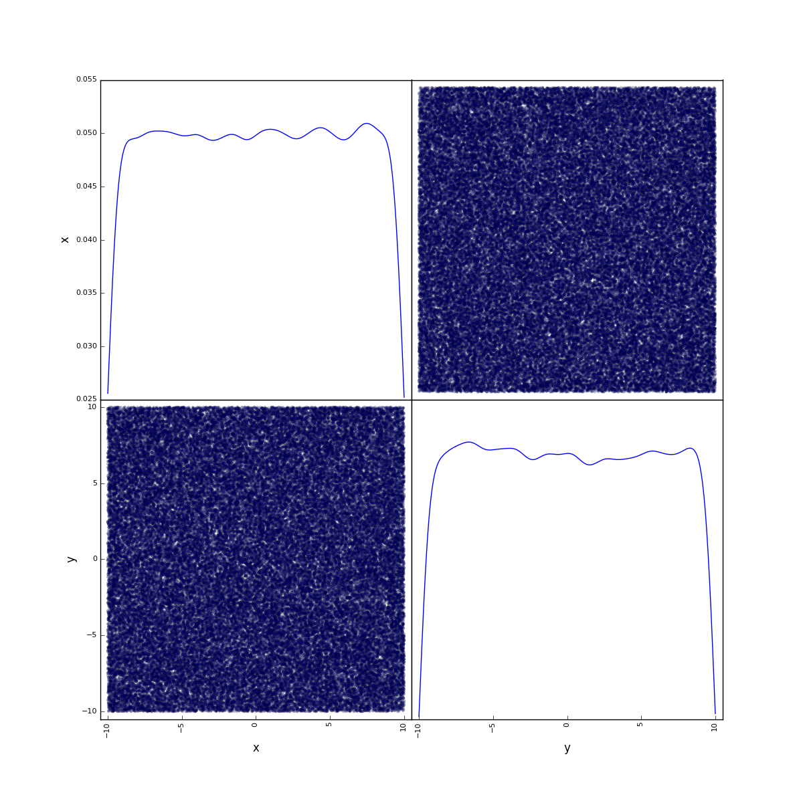
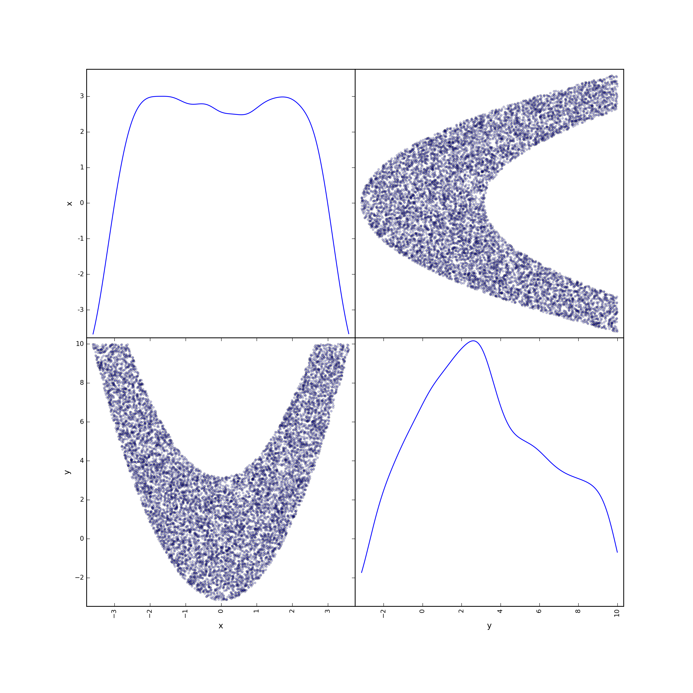

# Getting started

To start your experience with SPOTPY you need to have SPOTPY installed. Please see the [Installation chapter](index.md#installation) for further details.

You will find the following example in the `getting_started.py` file under the folder `/examples`. There is no need for copy paste work.

To use SPOTPY we have to import it and use one of the pre-build examples:

	import spotpy                                                # Load the SPOT package into your working storage 
	from spotpy import analyser                                  # Load the Plotting extension 
	from spotpy.examples.spot_setup_rosenbrock import spot_setup # Import the two dimensional Rosenbrock example	

The example comes along with parameter boundaries, the Rosenbrock function, the optimal value of the function and RMSE as a objective function.
So we can directly start to analyse the Rosenbrock function with one of the algorithms. We start with a simple Monte Carlo sampling:

	# Give Monte Carlo algorithm the example setup and saves results in a RosenMC.csv file
	sampler = spotpy.algorithms.mc(spotpy_setup(), dbname='RosenMC', dbformat='csv')

Now we can sample with the implemented Monte Carlo algorithm:
		
	sampler.sample(100000)                # Sample 100.000 parameter combinations
	results=sampler.getdata()			  # Get the results of the sampler

Now we want to have a look at the results. First we want to know, what the algorithm has done during the 100.000 iterations:

	spotpy.analyser.plot_parameterInteraction(results)     # Use the analyser to show the parameter interaction
	
This should give you a parameter interaction plot of your results, which should look like Fig. 1:
 

*Figure 1: Parameter interaction of the two dimensional Rosenbrock function*
 
We can see that the parameters *x* and *y*, which drive the the Rosenbrock function, vary between *-10* and *10*.

If you want to see the best 10% of your samples, which is called posterior parameter distribution, you have to do something like this:

	posterior=spotpy.analyser.get_posterior(results,threshold=0.9)
	spotpy.analyser.plot_parameterInteraction(posterior) 

This should give you a parameter interaction plot of your best 10% samples, which should look like Fig. 2:
 

*Figure 2: Posterior parameter interaction of the two dimensional Rosenbrock function*

This has reduced your parameter uncertainty for *x* of around 70% and for *y* for 40%, which is telling us, that we have a higher uncertainty for *y* than for *x* in our Rosenbrock example.

Note that your `results` are a normal NumPy array. That means you are not limited to pre-build plotting features and you can try out things on your own, e.g. like typing `plot(results['like'])`.

Let us find out the best found parameter set:

	print spotpy.analyser.get_best_parameterset(results)
	
And you will get something like

	>>> x=1.05  y=1.12 	

depending on your random results. The optimal best values for the Rosenbrock function are *x=1* and *y=1*.

Check out chapter [Rosenbrock Tutorial](Tutorial\2-Rosenbrock.md# The Rosenbrock) to see how the Rosenbrock function really looks like.