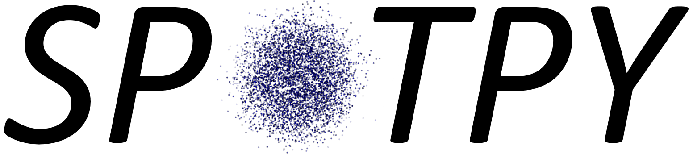
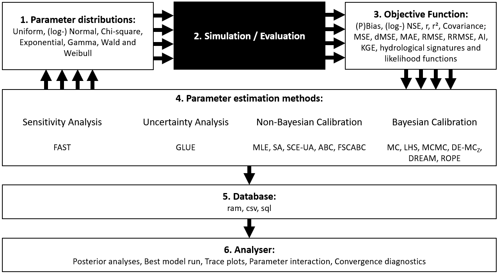

# Welcome to SPOTPY 
A Statistical Parameter Optimization Tool for Python


## Purpose

SPOTPY is a Python framework that enables the use of Computational optimization techniques for calibration, uncertainty and sensitivity analysis techniques of almost every (environmental-) model. The package is puplished in the open source journal PLoS One:

Houska, T., Kraft, P., Chamorro-Chavez, A. and Breuer, L.: SPOTting Model Parameters Using a Ready-Made Python Package, PLoS ONE, 10(12), e0145180, [doi:10.1371/journal.pone.0145180](http://journals.plos.org/plosone/article?id=10.1371%2Fjournal.pone.0145180 "doi:10.1371/journal.pone.0145180"), 2015
 
The simplicity and flexibility enables the use and test of different 
algorithms without the need of complex codes:

```
sampler = spotpy.algorithms.sceua(model_setup())     # Initialize your model with a setup file
sampler.sample(10000)                                # Run the model
results = sampler.getdata()                          # Load the results
spotpy.analyser.plot_parametertrace(results)         # Show the results
```


## Features
Complex algorithms bring complex tasks to link them with a model. 
We want to make this task as easy as possible. 
Some features you can use with the SPOTPY package are:

* Fitting models to evaluation data with different algorithms. 
Available algorithms are Monte Carlo (`MC`), Markov-Chain Monte-Carlo (`MCMC`), 
Maximum Likelihood Estimation (`MLE`), Latin-Hypercube Sampling (`LHS`), 
Simulated Annealing (`SA`), Shuffled Complex Evolution Algorithm (`SCE-UA`), 
Differential Evolution Adaptive Metropolis Algorithm (`DE-MCz`), 
RObust Parameter Estimation (`ROPE`), Artificial Bee Colony (`ABC`),
Fitness Scaled Chaotic Artificial Bee Colony (`FSCABC`) and Fourier Amplitude Sensitivity Test (`FAST`).

* Wide range of objective functions, likelihood functions and hydroligcal signatures to validate the sampled results. 
Available objective functions are:
Bias, Nash-Sutcliff (`NSE`), log Nash-Sutcliff (`logNSE`), Logarithmic probability (`logp`), Correlation Coefficient (`r`),
Coefficient of Determination (`r^2`), Mean Squared Error (`MSE`), Root Mean Squared Error (`RMSE`), Mean Absolute Error (`MAE`),
Relative Root Mean Squared Error (`RRMSE`), Agreement Index (`AI`), Covariance, Decomposed MSE (`dMSE`) and Kling-Gupta Efficiency (`KGE`).

* Prebuild parameter distribution functions: Uniform, Normal, logNormal, Chisquare,
Exponential, Gamma, Wald, Weilbull
      
* Suited to perform uncertainty-, sensitivity analysis or calibration
  of a model.

* Multi-objective support

* MPI support for fast parallel computing

* A progress bar monitoring the sampling loops. Enables you to plan your coffee breakes.

* Use of Numpy functions as often as possible. This makes your coffe breakes short.

* Different databases solutions: `ram` storage for fast sampling a simple and `csv` or `sql` tables
the save solution for long duration samplings.

* Automatic best run selecting and plotting

* Parameter trace plotting

* Parameter interaction plot including the Gaussian-kde function

* Regression analysis between simulation and evaluation data

* Posterior distribution plot

* Convergence diagnostics with Gelman-Rubin and the Geweke plot

## Relationship to other packages
A surprisingly small range of similar parameter estimation packages is available 

* [Pest](http://www.pesthomepage.org/ "Pest") Independent program for Model-Independent Parameter Estimation and Uncertainty Analysis
* [OpenBugs](http://www.mrc-bsu.cam.ac.uk/software/bugs/ "BUGS") Independent program for performing Bayesian inference Using Gibbs Sampling
* [JAGS](http://mcmc-jags.sourceforge.net/ "JAGS") Independent program similar to OpenBUGS
* [PyMC](https://github.com/pymc-devs/pymc "PyMC") Comprehensive Python package to analyse models with MCMC techniques  
* [STAN](http://mc-stan.org/ "STAN") Available in Python (amongst others) implementing MCMC techniques like NUTS, HMC and L-BFGS
* [emcee](http://dan.iel.fm/emcee/current/ "emcee") Python package using a Affine Invariant Markov chain Monte Carlo Ensemble sampler
* [BIP](http://bayesian-inference.googlecode.com/hg/trunk/BIP/Docs/build/html/index.html "BIP") Python package for bayesian inference with a DREAM sampler

All of them have their pros and cons. To benchmark SPOTPY against these packages would be difficult because of wide variety of settings in different algorithms. 
The most related one is certainly PyMC, which brings many ideas into this framework. 
At the moment is PyMC limited to MCMC algorithms when analysing external deterministic models. 
To test other algorithms in such a straightforward way was the main reason why SPOTPY was developed. 
Consequently, none of the packages can offer such a wide range of different algorithms like SPOTPY.

## Installation

### Dependencies
The SPOTPY is an open-source package written in pure Python. It runs on all major platforms (Windows, Linux, Mac). 
SPOTPY requires just some standard packages: 

* [NumPy](http://www.numpy.org/ "Numpy")
* [Scipy](http://www.scipy.org/ "Scipy")

Optional packages are:

* [Matplotlib](http://matplotlib.org/ "Matplotlib")
* [Pandas](http://pandas.pydata.org/ "Pandas")
* [mpi4py](http://mpi4py.scipy.org/ "mpi4py")
 
all packages are pre-installed e.g. in the following packages:

* [Python xy](https://code.google.com/p/pythonxy/ "Python xy") version >2.7
* [WinPython](http://winpython.sourceforge.net/ "WinPython) version >2.7

### Download
SPOTPY is available on [PYPI](https://pypi.python.org/pypi/spotpy "spotpy") and [GitHub](https://github.com/thouska/spotpy "spotpy"). 
This should make installation easy, as you just have to use a command window and type

	pip install spotpy
	
Alternatively, you can download the latest version of SPOTPY with a [SVN-Client](http://tortoisesvn.net/index.de.html "TortoiseSVN").
 
With this software you just have to check out: `svn://fb09-pasig.umwelt.uni-giessen.de/spotpy/trunk`

The recommended place for the SPOTPY package is in the site-packages folder in your Python Path, just the location of all other Python packages.

## Project layout

SPOTPY can work with any parameter distributions. A standard setup uses pre-build distributions from NumPy.
To benchmark the model-runs with a value, SPOTPY comes along with a wide range of pre-build objective functions.
All algorithms realized in the SPOTPY package can work with the Distributions and objective functions. One can use them for
uncertainty-, sensitivity analysis or parameter optimization.
The three packages together can be run in any combination and results are stored in the `ram` storage or in a `csv` file.
The results can be analysed with some pre-build statistics and plotting features.
 




*Above: Overview about functionality of the SPOTPY package*


	
	__init__.py             # Ensures that all needed files are loaded.
    analyser.py             # Plotting features and statistic analysis.
	database.py             # Ensures a secure data harbour during the sampling.
	objectivefunctions.py   # Library of pre-build evaluation functions
	likelihoods.py          # Library of pre-build evaluation functions
	signatures.py           # Library of pre-build evaluation functions
	
    algorithms/
        __init__.py   # Ensures the availability of all algorithms
		demcz.py      # Differential Evolution Markov Chain Monte Carlo
		lhs.py        # Latin Hypercube Sampling
		mcmc.py       # Metropolis Markov Chain Monte Carlo
		mle.py        # Maximum Likelihood Estimation
		mc.py         # Monte Carlo
		sceua.py      # Shuffled Complex Evolution
		sa.py         # Simulated annealing
		rope.py       # RObust Parameter Estimation
		fast.py       # Fourier Amplitude Sensitivity Testing
		abc.py        # Artificial Bee Colony
        fscabc.py     # Fitness Scaled Chaotic Artificial Bee Colony
		dream.py      # Differential Evolution Adaptive Metropolis 
	
	parallel/
		mpi.py        #Basic Parralel Computing features 
		mpipool.py	  #Basic Parralel Computing features 
		mproc.py      #Basic Parralel Computing features 
		sequential.py #Basic Parralel Computing features

	examples/
		spotpy_setup_ackley.py      # Example SPOTPY setup to analyse the Ackley function 
		spotpy_setup_griewank.py    # Example SPOTPY setup to analyse the Griewank function
		spotpy_setup_rosenbrock.py  # Example SPOTPY setup to analyse the Rosenbrock function
		getting_started.py          # Recommended test file for starters
		tutorial_rosenbrock.py      # Source code for the Rosenbrock example the Tutorial
		tutorial_griewank.py        # Source code for the Rosenbrock example the Tutorial
		tutorial_ackley.py          # Source code for the Rosenbrock example the Tutorial
		tutorial_Parameterlist_iterator.py        # Example how to sample given parameter combinations
		3dplot.py                   # Response surface plot of example files

